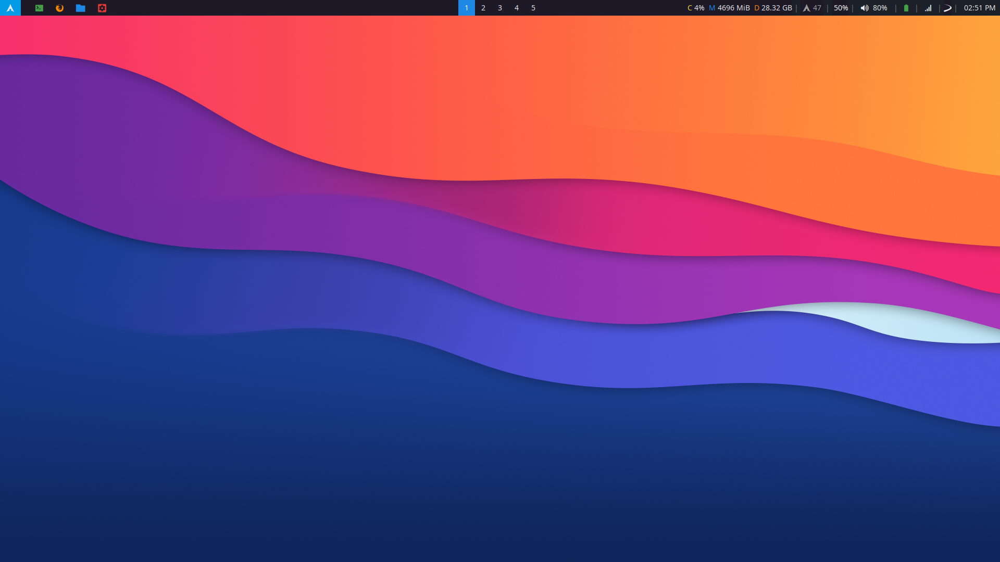

# dotfiles

All config files are hard linked to the actual files.

## dependencies

- **i3** (window manager, autostart, shortcuts)
- **polybar** (top bar)
- **polybar-themes** ([github](https://github.com/adi1090x/polybar-themes))
	- **rofi** (start menu)
	- **networkmanager_dmenu** (network menu)
- **xbindkeys** (some shortcuts)
- **terminator** (terminal)
- **taskwarrior-tui** (todo list)

## notes

### polybar

Custom modules thanks to:
- arch-updates module ([forum](https://forum.archlabslinux.com/t/polybar-missing-icons-after-new-install/4086/4))
- brightnesctl module ([github](https://github.com/pim-wtf/brightnessctl-polybar))
- redshift module ([github](https://github.com/VineshReddy/polybar-redshift))

### xbindkeys

- I was forced to use xbindkeys just because I wasn't able to make the **Super_L** key work with i3 as a standalone key to launch the polybar "start" menu