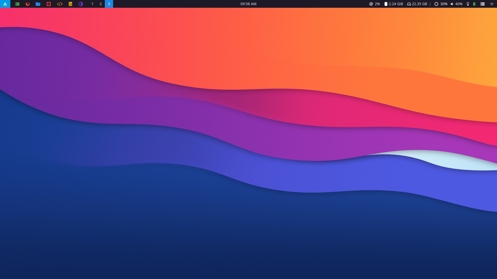

# dotfiles

<!--  -->

## OS

Arch Linux

## dependencies

- **i3** (window manager, autostart, shortcuts)
- **polybar** (top bar)
- **polybar-themes** ([adi1090x](https://github.com/adi1090x/polybar-themes))
- **rofi** (start menu)
- **nm-applet** (system tray network applet)
- **xbindkeys** (some shortcuts)
- **terminator** (terminal)
- **i3lock** (lock screen, [i3](https://github.com/i3/i3lock))
- **xautolock** (auto lock screen)
- **i3-hud-menu** (app menu with dmenu, [morrolinux](https://github.com/morrolinux/i3-hud-menu))
- my [**rofi-utils**](https://github.com/twoojoo/rofi-utils)
- **picomp ??** (compositor)
- **cbatticon** (system tray battery icon)
- **pavucontrol** (GUI audio input/output management)

## notes

### polybar

Custom modules thanks to:
- arch-updates module ([forum](https://forum.archlabslinux.com/t/polybar-missing-icons-after-new-install/4086/4))
- brightnesctl module ([pim-wtf](https://github.com/pim-wtf/brightnessctl-polybar))
- redshift module ([VineshReddy](https://github.com/VineshReddy/polybar-redshift))

### xbindkeys

I was forced to use xbindkeys just because I wasn't able to make the **Super_L** key work with i3 as a standalone key to launch the rofi "start" menu

### picomp

I'm still struggling to make Nvidia drivers not cause picomp to freeze the screen every now and then. I'm not using a compositor at the moment.